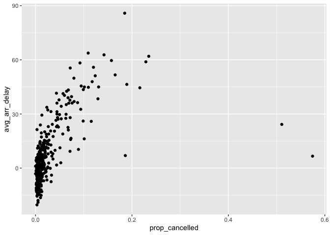

hw1
================
2022-09-22

``` r
library(ggplot2)
```

    ## Warning: package 'ggplot2' was built under R version 4.1.1

``` r
library(dplyr)
```

    ## 
    ## Attaching package: 'dplyr'

    ## The following objects are masked from 'package:stats':
    ## 
    ##     filter, lag

    ## The following objects are masked from 'package:base':
    ## 
    ##     intersect, setdiff, setequal, union

``` r
library(nycflights13)
```

# Q1

How many flights have a missing dep_time?

``` r
flights %>% filter(is.na(dep_time)) %>% summarise(num=n())
```

    ## # A tibble: 1 × 1
    ##     num
    ##   <int>
    ## 1  8255

What other variables are missing?

``` r
colnames(flights)[colMeans(is.na(flights))>0]
```

    ## [1] "dep_time"  "dep_delay" "arr_time"  "arr_delay" "tailnum"   "air_time"

``` r
colMeans(is.na(flights))
```

    ##           year          month            day       dep_time sched_dep_time 
    ##    0.000000000    0.000000000    0.000000000    0.024511842    0.000000000 
    ##      dep_delay       arr_time sched_arr_time      arr_delay        carrier 
    ##    0.024511842    0.025871796    0.000000000    0.028000808    0.000000000 
    ##         flight        tailnum         origin           dest       air_time 
    ##    0.000000000    0.007458964    0.000000000    0.000000000    0.028000808 
    ##       distance           hour         minute      time_hour 
    ##    0.000000000    0.000000000    0.000000000    0.000000000

What might these rows represent?

``` r
flights %>% filter(is.na(dep_time)) %>% head(., 5)
```

    ## # A tibble: 5 × 19
    ##    year month   day dep_time sched_dep_time dep_delay arr_time sched_arr_time
    ##   <int> <int> <int>    <int>          <int>     <dbl>    <int>          <int>
    ## 1  2013     1     1       NA           1630        NA       NA           1815
    ## 2  2013     1     1       NA           1935        NA       NA           2240
    ## 3  2013     1     1       NA           1500        NA       NA           1825
    ## 4  2013     1     1       NA            600        NA       NA            901
    ## 5  2013     1     2       NA           1540        NA       NA           1747
    ## # … with 11 more variables: arr_delay <dbl>, carrier <chr>, flight <int>,
    ## #   tailnum <chr>, origin <chr>, dest <chr>, air_time <dbl>, distance <dbl>,
    ## #   hour <dbl>, minute <dbl>, time_hour <dttm>

``` r
flights %>% filter(!is.na(dep_time), is.na(arr_time)) %>% head(., 5)
```

    ## # A tibble: 5 × 19
    ##    year month   day dep_time sched_dep_time dep_delay arr_time sched_arr_time
    ##   <int> <int> <int>    <int>          <int>     <dbl>    <int>          <int>
    ## 1  2013     1     1     2016           1930        46       NA           2220
    ## 2  2013     1     2     2041           2045        -4       NA           2359
    ## 3  2013     1     2     2145           2129        16       NA             33
    ## 4  2013     1     9      615            615         0       NA            855
    ## 5  2013     1     9     2042           2040         2       NA           2357
    ## # … with 11 more variables: arr_delay <dbl>, carrier <chr>, flight <int>,
    ## #   tailnum <chr>, origin <chr>, dest <chr>, air_time <dbl>, distance <dbl>,
    ## #   hour <dbl>, minute <dbl>, time_hour <dttm>

# Question 2

Currently dep_time and sched_dep_time are convenient to look at, but
hard to compute with because they’re not really continuous numbers.
Convert them to a more convenient representation of number of minutes
since midnight.

# Question 3

Look at the number of canceled flights per day. Is there a pattern? Is
the proportion of canceled flights related to the average delay? Use
multiple dyplr operations, all on one line, concluding with
`ggplot(aes(x= ,y=)) + geom_point()`

``` r
flights %>% group_by(year, month, day) %>% summarise(avg_arr_delay = mean(arr_delay, na.rm=T), prop_cancelled = mean(is.na(arr_delay))) %>% ggplot(aes(x=prop_cancelled ,y=avg_arr_delay)) + geom_point()
```

<!-- -->
