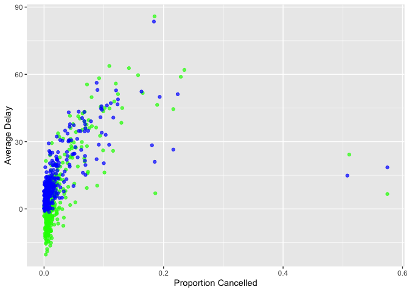

hw1
================
2022-09-22

``` r
library(ggplot2)
```

    ## Warning: package 'ggplot2' was built under R version 4.1.1

``` r
library(dplyr)
library(nycflights13)
```

# Q1

How many flights have a missing dep_time?

``` r
(flights %>% filter(is.na(dep_time)) %>% summarise(num=n()))$num
```

    ## [1] 8255

What other variables are missing?

``` r
colnames(flights)[colMeans(is.na(flights))>0]
```

    ## [1] "dep_time"  "dep_delay" "arr_time"  "arr_delay" "tailnum"   "air_time"

What might these rows represent?

One can see that the proportions of missing data in dep_time, dep_delay,
arr_time, arr_delay, air_time are very close to each other:

``` r
colMeans(is.na(flights))
```

    ##           year          month            day       dep_time sched_dep_time 
    ##    0.000000000    0.000000000    0.000000000    0.024511842    0.000000000 
    ##      dep_delay       arr_time sched_arr_time      arr_delay        carrier 
    ##    0.024511842    0.025871796    0.000000000    0.028000808    0.000000000 
    ##         flight        tailnum         origin           dest       air_time 
    ##    0.000000000    0.007458964    0.000000000    0.000000000    0.028000808 
    ##       distance           hour         minute      time_hour 
    ##    0.000000000    0.000000000    0.000000000    0.000000000

The more common phenomenon of NULL arrivals and departures can be
attributed to cancelled flights.

``` r
flights %>% filter(is.na(dep_time)) %>% summarise(count=n())
```

    ## # A tibble: 1 × 1
    ##   count
    ##   <int>
    ## 1  8255

The less common phenomenon of NULL arrivals and NON-NULL departures can
be attributed to possible first flights.

``` r
flights %>% filter(!is.na(dep_time), is.na(arr_time)) %>% summarise(count=n())
```

    ## # A tibble: 1 × 1
    ##   count
    ##   <int>
    ## 1   458

The rest can be categorized as erroneous data entries.

# Question 2

Currently dep_time and sched_dep_time are convenient to look at, but
hard to compute with because they’re not really continuous numbers.
Convert them to a more convenient representation of number of minutes
since midnight.

``` r
dep_time_in_mins = floor(flights$dep_time/100)*60 + ((flights$dep_time/100) - floor(flights$dep_time/100))*100
sched_dep_time_in_mins = floor(flights$sched_dep_time/100)*60 + ((flights$sched_dep_time/100)-floor(flights$sched_dep_time/100))*100
```

``` r
head(dep_time_in_mins, 5)
```

    ## [1] 317 333 342 344 354

``` r
head(sched_dep_time_in_mins, 5)
```

    ## [1] 315 329 340 345 360

# Question 3

Look at the number of canceled flights per day. Is there a pattern? Is
the proportion of canceled flights related to the average delay? Use
multiple dyplr operations, all on one line, concluding with
`ggplot(aes(x= ,y=)) + geom_point()`

``` r
flights %>% group_by(year, month, day) %>% summarise(avg_arr_delay = mean(arr_delay, na.rm=T), prop_cancelled = mean(is.na(arr_delay))) %>% ggplot(aes(x=prop_cancelled ,y=avg_arr_delay)) + geom_point()
```

<!-- -->
